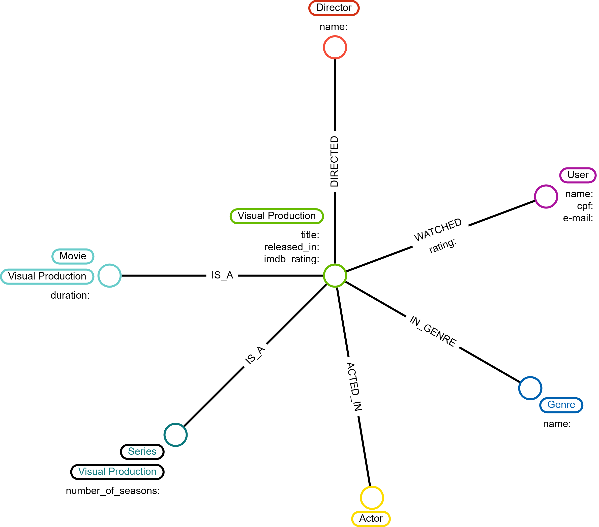

# Modelagem de Dados: Grafo de Serviço de Streaming

Este repositório contém a documentação da modelagem lógica de dados para uma plataforma de streaming, utilizando o [Arrows.app](https://arrows.app/).

---

## Estrutura do Grafo

O modelo é baseado em **Nós** que representam entidades e **Relacionamentos** que conectam essas entidades através de propriedades semânticas.

### 1. Entidades (Nós) e Atributos

| Nodo | Atributos | Descrição |
| :--- | :--- | :--- |
| **Visual Production** | `title`, `released_in`, `imdb_rating` | Entidade abstrata central para conteúdos. |
| **Movie** | `duration` | Especialização de produção (Filme). |
| **Series** | `number_of_seasons` | Especialização de produção (Série). |
| **User** | `name`, `cpf`, `e-mail` | Espectador da plataforma. |
| **Director** | `name` | Responsável pela direção técnica/artística. |
| **Actor** | `name` | Elenco que participa das produções. |
| **Genre** | `name` | Categoria/Gênero cinematográfico. |

### 2. Relacionamentos

* **`DIRECTED`**: Conecta `Director` → `Visual Production`.
* **`ACTED_IN`**: Conecta `Actor` → `Visual Production`.
* **`IN_GENRE`**: Conecta `Visual Production` → `Genre`.
* **`WATCHED`**: Conecta `User` → `Visual Production`. Possui a propriedade `rating` (nota dada pelo usuário).
* **`IS_A`**: Define a herança de tipo (ex: `Movie` **é uma** `Visual Production`).

---